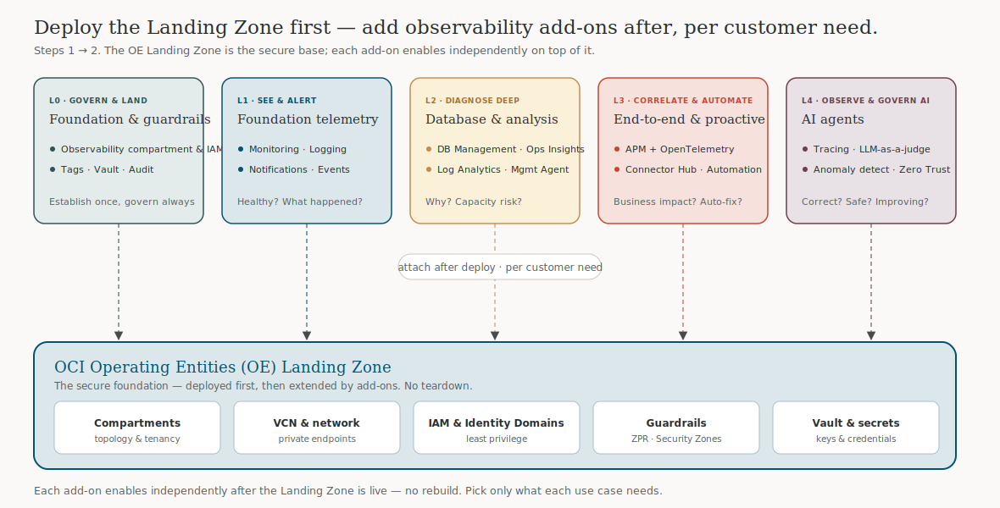

# OCI Observability Atlas

**A guided path from L0 to L4 for designing enterprise observability on Oracle Cloud Infrastructure — with every service framed as a Landing Zone add-on you attach after deployment, per customer need.**

🔗 **Live:** [obs.octodemo.cloud](https://obs.octodemo.cloud) · mirror: [adibirzu.github.io/obs](https://adibirzu.github.io/obs/)

Built on the [Oracle Redwood Design System](https://www.oracle.com/) (Georgia + Figtree, warm-stone palette, Lucide icons). Static, self-contained, no build step.

---

## What this is

A single-page guide that helps **any user** — executive, architect, or practitioner — find the right OCI Observability & Management (O&M) services for their use case and adopt them in the right order:

- **Use-case finder** — pick your estate pattern (traditional app, database-centric, OKE, Oracle apps, hybrid, agentic) and get a recommended path with concrete outcomes.
- **The L0 → L4 ladder** — 31 O&M and AI services, each opening an inspector with Executive / Architect / Practitioner lenses, copy-ready MQL/OCL/OTel snippets, and a "Learn more" panel of curated guides + open-source projects.
- **Collection-agent comparison** — Oracle Cloud Agent vs. Management Agent vs. Unified Monitoring Agent.
- **AI agent observability (L4)** — the SAIF / Zero Trust / Observability triad and a modern Instrument → Collect → Analyse → Evaluate → Act reference diagram.
- **Landing Zone add-ons** — how observability attaches **after** the OCI Operating Entities (OE) Landing Zone is deployed (see the diagram below).
- **Resources** — curated DevRel guides, demos, and the maintainer's public observability projects, mapped per service.
- **[Interactive launchpad](https://obs.octodemo.cloud/launchpad.html)** — the companion operations console.

## The L0 → L4 model

| Level | Theme | Question it answers | Example services |
|---|---|---|---|
| **L0** | Govern & land | Is the platform ready to be observed safely? | Observability compartment & IAM, Tags, Vault, Audit |
| **L1** | See & alert | Is it healthy, and what just happened? | Monitoring, Logging, Notifications, Events, Health Checks, Dashboards |
| **L2** | Diagnose deep | Why did it happen, and are we out of room? | Database Management, Ops Insights, Log Analytics, Management Agent, Stack Monitoring, Java Management |
| **L3** | Correlate & automate | What's the business impact, and what can self-heal? | APM + OpenTelemetry, Connector Hub, Resource Scheduler, OS Management Hub, Fleet App Mgmt |
| **L4** | Observe & govern AI | Is the agent correct, grounded, safe, improving? | APM GenAI, Generative AI (judge) + guardrails, Logging Analytics anomaly, Data Science eval, Cloud Guard Instance Security, Gen AI Agents |

## Landing Zone add-ons — attach after deploy

Observability is **not** a separate build. Deploy the [OCI Operating Entities (OE) Landing Zone](https://github.com/adibirzu/oci-landing-zone-operating-entities) first; then enable each add-on independently, on top of the live Landing Zone, choosing only what each use case needs — no teardown.



Editable diagram sources: [`draw.io`](assets/diagrams/lz-addons-architecture.drawio) · [`Excalidraw`](assets/diagrams/lz-addons-architecture.excalidraw) · [`SVG`](assets/diagrams/lz-addons-architecture.svg). See also the DevRel [LZ add-ons for Database Management](https://github.com/oracle-devrel/technology-engineering/tree/main/observability-and-management/database-management/LZ-addons) and [Ops Insights](https://github.com/oracle-devrel/technology-engineering/tree/main/observability-and-management/operations-insights/LZ-addons).

## Propose a new monitoring scenario

This guide is meant to grow. To add a use case (e.g. "observability for an EBS estate" or "tracing a CrewAI multi-agent app"):

1. Read **[docs/PROPOSE-A-SCENARIO.md](docs/PROPOSE-A-SCENARIO.md)** — the scenario template and what a good one contains.
2. Open a **[Monitoring scenario issue](../../issues/new?template=monitoring-scenario.yml)** (or copy the template into a PR).
3. Or extend the data directly: add an entry to [`assets/resources.js`](assets/resources.js) (links/projects per service) or propose a new finder pattern in [`assets/guide.js`](assets/guide.js).

## Run locally

```bash
git clone https://github.com/adibirzu/obs.git
cd obs
python3 -m http.server 8000
# open http://localhost:8000
```

No dependencies, no build. Fonts load from Google Fonts; all other assets are vendored.

## Repository layout

```
index.html                     the guide (single page)
launchpad.html                 companion operations console
assets/
  guide.css / guide.js         page styles + behaviour (data-driven catalog)
  resources.js                 curated guides + projects per service (shared)
  launchpad-resources.js       injects "Further reading" into launchpad modules
  redwood/                     vendored Oracle Redwood tokens + brand assets
  diagrams/                    lz-addons-architecture .svg / .drawio / .excalidraw
static/                        launchpad assets (css/js/icons)
docs/
  observability-design-guide.md   full enterprise design guide (reference)
  PROPOSE-A-SCENARIO.md           how to propose a monitoring scenario
CNAME                          custom domain (obs.octodemo.cloud)
```

## Sources & credits

- **[docs/observability-design-guide.md](docs/observability-design-guide.md)** — the full enterprise OCI observability design guide.
- OCI Secure AI Framework (SAIF), Zero Trust for AI Agents, and AI Observability for Agents whitepapers (the L4 layer).
- [oracle-devrel/technology-engineering — observability-and-management](https://github.com/oracle-devrel/technology-engineering/tree/main/observability-and-management) and the [OCI Observability blog](https://blogs.oracle.com/observability/).
- Reference implementation: [octo-observability-demo](https://github.com/adibirzu/octo-observability-demo).
- Project references curated from the maintainer's **public** OCI observability repositories.

## License

MIT — see [LICENSE](LICENSE) if present, or treat the content as reference material. Oracle, OCI, and Redwood are trademarks of Oracle and/or its affiliates. Service names and support status change; recheck the official OCI documentation.
