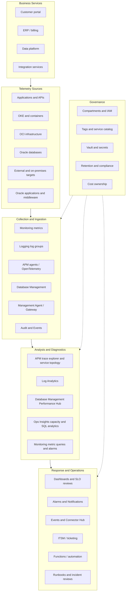

# Designing Enterprise Observability with Oracle Cloud Infrastructure

Status: GitHub-ready reference guide  
Last reviewed: 2026-06-15  
Scope: OCI Observability and Management services for enterprise infrastructure, applications, databases, logs, traces, capacity analytics, audit data, alerting, and incident response.

## Table of Contents

- [Executive Summary](#executive-summary)
- [Audience and Scope](#audience-and-scope)
- [Design Goals](#design-goals)
- [OCI Service Roles](#oci-service-roles)
- [Reference Architecture](#reference-architecture)
- [Design Principles](#design-principles)
- [Telemetry and Correlation Model](#telemetry-and-correlation-model)
- [Governance, IAM, and Tenancy Design](#governance-iam-and-tenancy-design)
- [Core OCI Service Design](#core-oci-service-design)
- [Database Observability Focus](#database-observability-focus)
- [Dashboard and SLO Design](#dashboard-and-slo-design)
- [Alerting and Incident Design](#alerting-and-incident-design)
- [Common Architecture Patterns](#common-architecture-patterns)
- [Observability Design Workshop](#observability-design-workshop)
- [Adoption Roadmap](#adoption-roadmap)
- [Implementation Checklist](#implementation-checklist)
- [Success Metrics](#success-metrics)
- [Anti-Patterns to Avoid](#anti-patterns-to-avoid)
- [Recommended GitHub Repository Structure](#recommended-github-repository-structure)
- [References](#references)

## Executive Summary

Enterprise observability is not only a monitoring project. It is an operating capability that helps teams detect service degradation, investigate root cause, reduce mean time to restore, improve database and application performance, manage capacity risk, and connect technical health to business service impact.

This guide describes how to design an enterprise observability solution using Oracle Cloud Infrastructure (OCI) native Observability and Management services. The target design combines metrics, logs, traces, events, audit data, database diagnostics, capacity analytics, dashboards, alerts, notifications, and runbooks into a practical operating model.

The recommended outcome is a service-oriented observability architecture where each critical business service has defined telemetry, owners, SLOs, dashboards, alerts, escalation paths, and improvement routines.

## Audience and Scope

This guide is intended for:

- Enterprise architects
- Cloud architects
- Platform engineering teams
- Operations and NOC teams
- Site Reliability Engineering teams
- DevOps teams
- Database administrators
- Application owners
- Security, compliance, and governance teams
- FinOps and capacity planning teams

Use this guide during:

- OCI landing zone and operating model design
- Cloud migration and modernization programs
- Oracle Database modernization
- Exadata, Autonomous AI Database, and hybrid database programs
- Kubernetes and cloud-native application deployments
- Oracle Applications and middleware modernization
- Operational excellence assessments
- SRE and DevOps adoption programs

This guide focuses on OCI-native capabilities. It can coexist with third-party observability, SIEM, ITSM, or AIOps platforms when the enterprise already has those tools.

## Design Goals

The observability design should help the customer answer these questions:

| Question | Primary Capability |
|---|---|
| Is the service healthy? | Metrics, dashboards, alarms, SLOs |
| What happened? | Logs, audit events, resource events |
| Why did it happen? | Traces, service topology, diagnostics, log analytics |
| Which database or SQL workload is affected? | Database Management, Ops Insights, APM correlation |
| Are we at risk of capacity exhaustion? | Ops Insights, capacity dashboards, forecast reviews |
| Who needs to act? | Notifications, Events, ITSM integration, runbooks |
| What is the business impact? | Business service dashboards, SLO burn, user journey checks |
| What should happen automatically? | Events, Notifications, Connector Hub, Functions, automation workflows |

The target state is a correlated observability architecture that covers infrastructure, applications, databases, middleware, Kubernetes, logs, metrics, traces, capacity, security events, audit events, and business service health.

## OCI Service Roles

Use the following service roles as the starting point for an OCI observability design. Not every service is required for every workload.

| Area | OCI Service | Primary Role | Design Notes |
|---|---|---|---|
| Metrics and alarms | OCI Monitoring | Query metrics, publish custom metrics, create alarms, monitor resource health and capacity | Use for OCI resource metrics, custom metrics, MQL queries, and actionable alarms. |
| Central log collection | OCI Logging | Centralized, managed access to logs from OCI resources, custom applications, and agents | Use log groups, retention policies, and structured log standards. |
| Advanced log analysis | OCI Log Analytics | Index, enrich, aggregate, search, correlate, visualize, and alert on log data | Oracle Logging Analytics has been renamed Oracle Log Analytics. Use it for pattern detection, clustering, dashboards, and investigations. |
| Application performance | OCI Application Performance Monitoring | Distributed tracing, service topology, browser monitoring, synthetic monitoring, latency and error analysis | Use OCI APM agents or OpenTelemetry where appropriate. APM can ingest OTLP spans and metrics and selected open-source trace formats. |
| Database operations | OCI Database Management | Oracle Database fleet monitoring, Performance Hub, SQL performance, sessions, waits, dashboards, administration, database groups, and jobs | Use Basic or Full management according to criticality, target type, feature need, and cost model. |
| Capacity and fleet analytics | OCI Ops Insights | Long-term capacity, utilization, forecasting, SQL Insights, AWR analysis, Exadata insights, news reports | Use for proactive reviews, capacity planning, growth forecasting, optimization, and fleet-level trends. |
| Audit and governance | OCI Audit | Visibility into OCI API activity and tenancy/resource changes | Use for security audit, compliance, forensic analysis, and governance. |
| State-change automation | OCI Events | Automation based on OCI resource state changes | Route events to Notifications, Functions, Streaming, or other targets. |
| Human and system notifications | OCI Notifications | Topics and subscriptions for alarms, event rules, connectors, email, SMS, HTTPS, PagerDuty, Functions, and more | Define topics by severity, service, and ownership model. |
| Data movement | OCI Connector Hub | Move data between OCI services such as Logging, Log Analytics, Object Storage, Streaming, Monitoring, and Functions | Use for log routing, archive, SIEM export, and operational automation pipelines. |
| Hybrid collection | OCI Management Agent and Management Gateway | Data collection and controlled communication between OCI and external targets | Use for external databases, hosts, Log Analytics, Ops Insights, Database Management, and hybrid estates. |
| Application stack monitoring | OCI Stack Monitoring | Monitoring and alarm management for application stacks and underlying infrastructure | Stack Monitoring is documented as deprecated and available until January 23, 2027. Treat it as a transition or existing-estate service, not a default net-new strategic dependency. |

## Reference Architecture



## Design Principles

### 1. Design Around Business Services

Start with the customer's most important business services, not individual resources. Examples include online banking, order management, ERP, billing, customer portal, supply chain, analytics, and integration platforms.

For each business service, map:

- Applications and APIs
- Databases and schemas
- Middleware and integration points
- Infrastructure dependencies
- Network dependencies
- External dependencies
- Owners and support groups
- SLAs, SLOs, and error budgets
- Critical user journeys
- Recovery and escalation requirements

### 2. Collect Telemetry with a Purpose

Collect telemetry that supports a decision, diagnosis, SLO, security requirement, capacity review, or business service view. Avoid collecting high-volume telemetry without ownership, retention, cost, or access design.

| Telemetry Type | Purpose |
|---|---|
| Metrics | Health, trends, saturation, performance indicators, alarms |
| Logs | Events, errors, audit history, application details, security investigation |
| Traces | End-to-end transaction flow, latency, service dependency, root cause analysis |
| Events | Resource state changes and automation triggers |
| Audit data | Governance, compliance, forensic investigation, change tracking |
| Database telemetry | SQL performance, wait events, sessions, Data Guard state, storage, configuration |
| Capacity analytics | Growth trends, forecasted exhaustion, optimization, consolidation planning |
| Synthetic checks | Availability and user journey validation from controlled locations |

### 3. Make Databases a First-Class Observability Domain

For many enterprise customers, the database layer is the most business-critical part of the service. The design should include a dedicated database observability track covering availability, SQL performance, wait events, sessions, storage, backup indicators, Data Guard, configuration, fleet health, capacity forecasting, growth trends, and operational risk.

OCI Database Management and OCI Ops Insights should be treated as core services in the observability architecture, not optional add-ons for DBA-only use.

### 4. Correlate Across Metrics, Logs, Traces, and Database Signals

An incident should be explainable across layers:

- User journey or synthetic check degradation
- APM trace showing the slow service or call path
- Application logs with the same trace or correlation ID
- Infrastructure metrics showing saturation or errors
- Database Management view showing SQL, waits, sessions, locks, or Data Guard state
- Ops Insights trend showing whether the issue is part of longer-term growth
- Audit or Events data showing related changes

### 5. Reduce Noise and Improve Actionability

Every alert should have:

- Owner
- Severity
- Business impact
- Runbook
- Escalation path
- Expected action
- Maintenance suppression approach
- Route into the correct response channel

Alerts that do not trigger action should be converted into dashboard signals, review items, or reports.

### 6. Secure Observability by Design

Observability data can contain sensitive technical, business, user, and security information. The design must define IAM, compartments, network paths, private endpoints, secrets, retention, data residency, log redaction, and separation of duties before broad telemetry ingestion.

## Telemetry and Correlation Model

### Standard Resource Tags

Use defined tags consistently across resources and telemetry. Recommended tags:

| Tag | Example | Purpose |
|---|---|---|
| `business_service` | `customer-portal` | Connect resources to service-level dashboards and ownership. |
| `environment` | `prod`, `preprod`, `test`, `dev` | Filter dashboards, alerts, cost, and retention. |
| `criticality` | `tier-0`, `tier-1`, `tier-2`, `tier-3` | Drive alarm severity, retention, and onboarding priority. |
| `owner` | `payments-platform` | Route incidents and review actions. |
| `cost_center` | `cc-12345` | Support FinOps and showback. |
| `data_classification` | `public`, `internal`, `restricted` | Drive retention, redaction, and access controls. |
| `observability_tier` | `baseline`, `enhanced`, `critical` | Define the expected telemetry depth. |

### Log Field Standards

Application logs should include these fields where possible:

| Field | Purpose |
|---|---|
| `timestamp` | Event time in ISO 8601 format. |
| `severity` | Standard severity such as debug, info, warn, error, fatal. |
| `service.name` | Logical application or service name. |
| `environment` | Environment name. |
| `region` | OCI region or site. |
| `host.name` or `resource.id` | Infrastructure context. |
| `trace.id` and `span.id` | Correlation with APM traces. |
| `request.id` or `correlation.id` | Cross-system troubleshooting. |
| `business_service` | Service-level grouping. |
| `user_journey` | Optional high-value business journey context. |
| `error.code` and `error.message` | Structured error analysis. |

### Trace Standards

Use OpenTelemetry for cloud-native and polyglot applications where practical. Standardize on W3C trace context unless an existing integration requires another propagation format. For OCI APM, define:

- APM domains by environment or platform boundary
- Service names and naming rules
- Sampling strategy
- Sensitive attribute filtering
- Browser agent scope for real-user monitoring
- Synthetic monitoring scope for critical journeys
- Trace-to-log correlation requirements

## Governance, IAM, and Tenancy Design

### Compartment Strategy

Choose a compartment model that supports both operational access and service ownership. Common patterns:

- By environment: `prod`, `preprod`, `dev`
- By business domain: `payments`, `erp`, `analytics`
- By platform: `shared-network`, `database-platform`, `observability`
- By regulatory boundary: `regulated`, `non-regulated`

For enterprise observability, create a central observability compartment or platform boundary for shared resources such as dashboards, log groups, Log Analytics configuration, connector definitions, notification topics, and automation.

### IAM Model

Use least privilege and separation of duties. Avoid one broad observability administrator group for all tasks.

Recommended groups:

| Group | Responsibilities |
|---|---|
| `obs-platform-admins` | Configure shared observability services, policies, connectors, dashboards, and notification channels. |
| `obs-readers` | Read dashboards, logs, metrics, and operational views. |
| `obs-log-admins` | Manage log groups, log retention, parsers, sources, and log ingestion. |
| `obs-apm-admins` | Manage APM domains, agents, data keys, and synthetic monitors. |
| `dbobs-admins` | Enable Database Management and Ops Insights, manage private endpoints, database groups, and credentials. |
| `dbobs-readers` | Read database fleet dashboards, capacity reports, and performance views. |
| `security-audit-readers` | Read Audit data and security-relevant logs. |
| `automation-operators` | Operate approved Functions, event rules, and remediation workflows. |

### Credentials and Secrets

Use OCI Vault for secrets used by Database Management, APM, automation, integrations, and external endpoints. Define:

- Secret ownership
- Rotation frequency
- Break-glass procedures
- Access policies
- Audit review process
- Separate credentials for read-only monitoring, diagnostics, and administrative actions

### Retention and Data Handling

Define retention by data type:

| Data Type | Retention Guidance |
|---|---|
| Operational logs | Retain long enough for incident investigation and release rollback analysis. |
| Security logs | Align with compliance, audit, and forensic requirements. |
| Audit logs | Export or archive when retention requirements exceed default service behavior. |
| APM traces | Retain based on diagnostic value, volume, and cost. |
| Database performance data | Retain according to DBA analysis, compliance, and capacity planning needs. |
| Capacity analytics | Retain enough history to support seasonal and growth forecasting. |

## Core OCI Service Design

### OCI Monitoring

OCI Monitoring is the foundation for metric queries and alarms. Use it for OCI resource metrics, custom application metrics, service health indicators, operational dashboards, and alert generation.

Design recommendations:

- Use metric namespaces and dimensions consistently.
- Build standard dashboards by service tier and audience.
- Use custom metrics for business KPIs and application SLIs that are not emitted by default OCI services.
- Define alarms only for actionable conditions.
- Use alarm severity based on business impact, not only technical threshold.
- Use maintenance suppression for planned changes.
- Avoid alerting on every metric.
- Review alarm history to remove noisy or non-actionable alarms.

Example alarm categories:

| Category | Examples |
|---|---|
| Availability | Instance down, endpoint unavailable, failed health checks |
| Saturation | CPU, memory, storage, connection pool, queue depth |
| Error rate | 5xx rate, failed jobs, failed API calls |
| Latency | User journey latency, API p95, database response time |
| Capacity risk | Storage exhaustion, high growth trend, resource allocation limit |

### OCI Logging

OCI Logging provides centralized access to logs from OCI resources, applications, and custom sources. Use it as the managed collection and search layer for operational logs.

Design recommendations:

- Define log groups by environment, business domain, or data classification.
- Enable OCI service logs for critical infrastructure and platform services.
- Use structured JSON logs for applications where possible.
- Include service name, environment, region, trace ID, and correlation ID.
- Separate operational logs from sensitive security logs.
- Define retention by compliance and operational need.
- Avoid continuous high-volume debug logging in production.
- Use Connector Hub to route logs to Log Analytics, Object Storage, Streaming, Functions, or downstream platforms.

### OCI Log Analytics

OCI Log Analytics is the advanced analysis layer for log data. Use it when log search alone is not enough.

Use cases:

- Pattern detection
- Semantic clustering
- Link analysis
- Root cause analysis
- Security investigation
- Application troubleshooting
- Operational dashboards
- Scheduled searches and detection rules
- Large-scale log analysis across sources

Design recommendations:

- Standardize sources, parsers, entities, and fields.
- Build saved searches for repeated investigation workflows.
- Use dashboards for operational and security views.
- Use scheduled searches for conditions that are better detected from logs than metrics.
- Keep parsing and enrichment logic versioned and documented.

### OCI Application Performance Monitoring

OCI APM provides deep application visibility, including distributed tracing, service topology, end-user monitoring, synthetic monitoring, latency analysis, error analysis, and application diagnostics.

Design recommendations:

- Instrument critical transactions first.
- Create APM domains aligned to environment and access model.
- Use OCI APM agents for supported workloads and OpenTelemetry where appropriate.
- Capture service-to-service latency, error rate, and dependency calls.
- Correlate traces with application logs using trace and span IDs.
- Define synthetic monitors for critical user journeys.
- Use browser monitoring for customer-facing applications where user experience matters.
- Define trace sampling intentionally so traces remain representative and cost-aware.
- Standardize service names before onboarding many teams.

### OCI Database Management

OCI Database Management Diagnostics & Management provides monitoring and management for Oracle Databases across supported OCI, external, and multicloud targets. Use it for database fleet monitoring, Performance Hub, SQL diagnostics, sessions, waits, configuration, dashboards, database groups, and controlled administration workflows.

Design recommendations:

- Enable Database Management for production and mission-critical databases first.
- Use Basic management for broad baseline coverage where supported and appropriate.
- Use Full management for critical, production, RAC, Exadata, Data Guard, and performance-sensitive databases that require deeper diagnostics.
- Plan Database Management enablement per region because Oracle documents that cross-region monitoring and management of Oracle Databases is not available.
- Use private endpoints or Management Agents based on target type and network design.
- Store monitoring credentials in OCI Vault.
- Use Database Groups for fleet views and controlled actions.
- Separate DBA read-only, performance analysis, credential administration, and job execution privileges.
- Integrate database alarms with the incident process.
- Create runbooks for common incidents such as storage pressure, blocking sessions, Data Guard lag, and SQL regression.

### OCI Ops Insights

OCI Ops Insights provides capacity planning and performance analytics across databases and hosts. Use it as the long-term intelligence layer for trends, forecasting, optimization, and fleet-level reviews.

Use cases:

- Database and host capacity planning
- CPU, storage, memory, and I/O trend analysis
- Forecasting growth and exhaustion risk
- SQL Insights and SQL Explorer
- AWR analysis where supported
- Exadata insights and cost attribution
- Weekly news reports and actionable insights
- Rightsizing, consolidation, and optimization

Design recommendations:

- Enable Ops Insights for business-critical databases and hosts early enough to collect useful baselines.
- Use it during migration and modernization programs to compare before and after performance and capacity patterns.
- Review capacity trends in monthly service reviews.
- Use default high and low utilization thresholds as a starting point, then customize by workload type and service tier.
- Combine Ops Insights with Database Management: Ops Insights identifies trends and risks; Database Management supports real-time diagnosis and action.
- Include Ops Insights output in architecture review boards, FinOps reviews, and capacity planning.
- Validate scope carefully for MySQL HeatWave because Oracle documents deprecation of Ops Insights for MySQL HeatWave for existing enabled resources until January 29, 2027.

### OCI Audit

OCI Audit provides visibility into activities related to OCI resources and the tenancy. Use it for governance, compliance, security audit, change tracking, and forensic investigation.

Design recommendations:

- Define who can read Audit data.
- Route or export Audit logs when required by retention or SIEM processes.
- Include Audit data in incident reviews when resource changes may have caused degradation.
- Build detections for high-risk changes such as policy changes, network changes, key changes, and deletion events.

### OCI Events, Notifications, and Connector Hub

Use OCI Events for state-change-driven automation, OCI Notifications for human-readable and system notifications, and OCI Connector Hub for moving observability data between services.

Design recommendations:

- Route Monitoring alarms and Events to Notifications topics by severity and ownership.
- Use separate topics for production critical, production warning, non-production, security, and capacity events.
- Use HTTPS subscriptions, Functions, or ITSM integrations for automated ticket creation and remediation.
- Use Connector Hub to route logs to Log Analytics, Object Storage, Streaming, Functions, or external platforms.
- Include failure handling and delivery monitoring for connectors and automation.

### OCI Management Agent and Management Gateway

Use Management Agent and Management Gateway for hybrid and external target collection. These are important for external databases, on-premises hosts, Log Analytics, Ops Insights, Database Management, and estates where direct connectivity to OCI services must be controlled.

Design recommendations:

- Define the agent placement model for each data center or network segment.
- Use Management Gateway where centralized outbound HTTPS communication is required.
- Monitor agent and gateway health.
- Document proxy, firewall, DNS, and TLS requirements.
- Include agent lifecycle management in patching and operations processes.

### OCI Stack Monitoring

OCI Stack Monitoring provides monitoring and alarm management for application stacks and underlying infrastructure, including hosts, application servers, and databases. However, Oracle documentation states that Stack Monitoring is deprecated and available for use until January 23, 2027.

Design recommendations:

- Do not make Stack Monitoring the default strategic dependency for new long-lived observability architectures.
- Use it only when there is a clear existing-estate, migration, or transition reason.
- For net-new designs, prefer combinations of OCI Monitoring, APM, Database Management, Ops Insights, Logging, Log Analytics, and Management Agent capabilities.
- For existing Stack Monitoring deployments, document the transition plan before the deprecation date.

## Database Observability Focus

Database observability should be designed as a dedicated workstream because database behavior often determines business service reliability and user experience.

### Database Service Split

| Need | Primary OCI Service | Design Pattern |
|---|---|---|
| Current database health and performance triage | Database Management | Use fleet views, single database monitoring, Performance Hub, waits, sessions, SQL views, and dashboards. |
| Long-term capacity planning | Ops Insights | Use database and host capacity planning for CPU, storage, memory, and I/O trends. |
| SQL regression and fleet SQL trends | Ops Insights and Database Management | Use Ops Insights for longer-term SQL trends and Database Management for current diagnostic drill-down. |
| Database fleet grouping | Database Management | Use Database Groups by business service, environment, platform, criticality, and maintenance wave. |
| Administration at scale | Database Management Jobs | Restrict job execution by role, group, and approval process. |
| Credentials and access control | Database Management plus OCI Vault | Use named or preferred credentials and Vault secrets. |
| Hybrid database onboarding | Database Management, Ops Insights, Management Agent/Gateway | Use external database handles, agents, gateways, private endpoints, and documented network paths. |
| Database capacity governance | Ops Insights | Include monthly capacity review and forecasted exhaustion dates. |

### Database Observability Tiers

| Tier | Scope | Expected Capabilities |
|---|---|---|
| Baseline | Non-critical production and selected pre-production databases | OCI Monitoring metrics, key logs, basic alarms, Database Management Basic where supported, owner and runbook metadata. |
| Enhanced | Important production databases and shared platforms | Database Management Full where justified, Ops Insights, database dashboards, SQL and wait analysis, capacity reports, incident integration. |
| Critical | Tier-0 and tier-1 business service databases | Full diagnostics, Performance Hub, SQL analysis, Data Guard monitoring, Ops Insights forecasting, APM correlation, synthetic journey correlation, 24x7 alerting, tested runbooks. |

### Database Onboarding Factory

Treat onboarding as a repeatable pipeline, not a console-only activity.

1. Inventory databases and normalize metadata.
2. Map each database to business service, environment, owner, criticality, platform, region, and observability tier.
3. Validate supported configuration, target type, version, licensing, and feature need.
4. Choose Database Management Basic or Full where supported.
5. Define network path: private endpoint, Management Agent, Management Gateway, or Enterprise Manager bridge where appropriate.
6. Create monitoring users with least privilege.
7. Store credentials and wallets in OCI Vault.
8. Apply IAM policies for service access and separation of duties.
9. Enable Database Management.
10. Enable Ops Insights where capacity, SQL, Exadata, or fleet analytics are required.
11. Add databases to Database Groups and dashboard filters.
12. Configure alarms, notification topics, and ITSM routing.
13. Validate data collection after the first collection window.
14. Create or attach runbooks for common incidents.
15. Review onboarding exceptions weekly until coverage is complete.

### Database Signal Catalog

| Signal | Why It Matters | Service |
|---|---|---|
| Availability and connection state | Confirms database is reachable and serving workloads. | Monitoring, Database Management |
| CPU utilization | Detects saturation and rightsizing opportunities. | Monitoring, Database Management, Ops Insights |
| Storage allocation and usage | Prevents storage exhaustion and supports growth planning. | Monitoring, Database Management, Ops Insights |
| Memory and I/O utilization | Identifies bottlenecks and platform saturation. | Database Management, Ops Insights |
| Average active sessions | Shows workload intensity and contention. | Database Management |
| Top SQL and SQL elapsed time | Identifies SQL statements driving response time. | Database Management, Ops Insights |
| Wait events | Explains database time and bottleneck categories. | Database Management |
| Blocking sessions and locks | Supports incident triage for stalled workloads. | Database Management |
| Data Guard role and lag | Protects availability and disaster recovery posture. | Database Management, Monitoring |
| Backup and recovery indicators | Supports recoverability and compliance. | Database service metrics, logs, runbooks |
| Capacity forecast | Shows future exhaustion risk. | Ops Insights |

### Database Design Questions

| Area | Questions |
|---|---|
| Estate | Which databases support critical business services? |
| Platform | Are databases running on Base Database Service, Exadata Database Service, Autonomous AI Database, Oracle Database@Azure, Oracle Database@AWS, AWS RDS for Oracle, or on-premises? |
| Ownership | Who owns operations: DBA, platform team, application team, managed service provider, or shared team? |
| Depth | Which databases need deep diagnostics versus baseline monitoring? |
| Performance | Which workloads need SQL performance and wait-event analysis? |
| Capacity | Which systems require 30, 90, 180, or 365 day forecasting? |
| Security | Who can view database performance, SQL text, parameters, and credentials? |
| Hybrid | How will external targets securely send telemetry to OCI? |
| Alerting | Which database conditions require immediate response? |
| Runbooks | What actions should be taken for common database incidents? |

## Dashboard and SLO Design

Dashboards should be designed around decisions and audiences. A dashboard without an owner or review cadence becomes stale quickly.

| Dashboard | Audience | Content |
|---|---|---|
| Executive Dashboard | CIO, CTO, service owners, business stakeholders | Business service health, SLA/SLO status, critical incidents, availability trends, major capacity risks. |
| Operations Dashboard | NOC, operations, SRE, platform team | Active alarms, infrastructure health, application health, log anomalies, service dependencies, incident queue. |
| DBA Dashboard | Database administrators, database platform team | Database fleet health, top SQL, waits, sessions, storage usage, resource utilization, backup and availability indicators, Data Guard, database incidents. |
| Capacity Dashboard | Infrastructure team, DBA team, FinOps, architecture team | CPU trends, memory trends, storage growth, I/O trends, forecasted exhaustion dates, underutilized resources, optimization candidates. |
| Application Team Dashboard | Application owners, developers, DevOps teams | Transaction latency, error rates, trace analysis, service dependencies, API health, release-related issues, user experience indicators. |
| Security and Audit Dashboard | Security, compliance, governance teams | Audit events, high-risk changes, access events, sensitive log patterns, policy changes, investigation queues. |

### SLO Examples

| Service Layer | Example SLI | Example SLO |
|---|---|---|
| Customer-facing API | Successful requests / total requests | 99.9 percent monthly success rate |
| User journey | Synthetic checkout completion | 99.5 percent successful checks during business hours |
| Database | p95 database call latency | p95 under agreed threshold for tier-1 transactions |
| Batch workload | Jobs completed before cutoff | 99 percent of daily jobs complete by agreed time |
| Platform | Critical alarms acknowledged | 95 percent acknowledged within target time |

## Alerting and Incident Design

### Severity Model

| Severity | Description | Example |
|---|---|---|
| Sev 1 | Business-critical outage or severe customer impact | Customer portal unavailable, payment processing down |
| Sev 2 | Major degradation with meaningful business impact | Database latency causing transaction failures |
| Sev 3 | Limited impact or partial degradation | One non-critical service degraded |
| Sev 4 | Informational or review item | Capacity trend requires review within the planning cycle |

### Alert Design Rules

Every alert should answer:

- What is broken?
- Who owns it?
- What business service is affected?
- What is the impact?
- What should be done?
- Where is the runbook?
- When should it escalate?
- How should it be suppressed during planned maintenance?

Avoid alerts that:

- Have no owner
- Require no action
- Duplicate another alert
- Fire during expected maintenance
- Are based only on low-level thresholds without service context
- Page humans for capacity trends that should be handled in a review cycle

### Example Alert Catalog

| Alert | Severity | Route | Runbook |
|---|---|---|---|
| Tier-0 synthetic journey failure from multiple locations | Sev 1 | Production critical topic, ITSM incident, on-call | Customer journey outage runbook |
| Database storage projected to exceed threshold in 30 days | Sev 4 or Sev 3 | Capacity review queue | Storage expansion and rightsizing runbook |
| Data Guard lag above service threshold | Sev 2 | DBA on-call, service owner | Data Guard lag runbook |
| API p95 latency above SLO for 15 minutes | Sev 2 or Sev 3 | Application on-call | Latency triage runbook |
| Authentication error spike | Sev 2 | App on-call, security if needed | Authentication incident runbook |
| Critical IAM policy change | Sev 3 or security severity | Security operations | OCI IAM change review runbook |

## Common Architecture Patterns

### Pattern 1: Traditional Enterprise Application

Typical stack: load balancer, web tier, application tier, middleware, Oracle Database, batch jobs, and integrations.

Recommended OCI services:

- Monitoring
- Logging
- Log Analytics
- APM for critical transactions
- Database Management
- Ops Insights
- Audit
- Notifications

### Pattern 2: Oracle Database-Centric Workload

Typical stack: Oracle Database, Exadata Database Service, Autonomous AI Database, Base Database Service, Data Guard, and external on-premises databases.

Recommended OCI services:

- Database Management
- Ops Insights
- Monitoring
- Logging
- Audit
- Notifications
- Management Agent and Gateway for external targets

### Pattern 3: Cloud-Native Application on OKE

Typical stack: OCI Kubernetes Engine, microservices, API Gateway, Load Balancer, Container Registry, Streaming, and Autonomous AI Database or Oracle Database.

Recommended OCI services:

- APM with OpenTelemetry
- Monitoring
- Logging
- Log Analytics
- Database Management
- Ops Insights
- Events
- Notifications
- Connector Hub

### Pattern 4: Oracle Applications and Middleware

Examples include Oracle E-Business Suite, JD Edwards, PeopleSoft, WebLogic, SOA Suite, and Fusion Middleware.

Recommended OCI services:

- Monitoring
- Logging
- Log Analytics
- APM where application instrumentation is feasible
- Database Management
- Ops Insights
- Management Agent
- Stack Monitoring only for existing or transitional use cases, with a documented deprecation transition plan

### Pattern 5: Hybrid Enterprise Estate

Typical stack: OCI resources, on-premises databases, on-premises applications, external monitoring tools, and an existing ITSM platform.

Recommended OCI services:

- Monitoring
- Logging
- Log Analytics
- Database Management
- Ops Insights
- Management Agent
- Management Gateway
- Events
- Notifications
- Connector Hub

## Observability Design Workshop

### Phase 1: Business Objectives

Identify critical business services, revenue-generating applications, customer-facing systems, regulatory requirements, operational SLAs, current pain points, and incident history.

Workshop questions:

- Which outage has the biggest business impact?
- Which services are mission critical?
- Which systems have frequent incidents?
- Which applications are difficult to troubleshoot?
- Which databases require the most DBA attention?
- Where is capacity planning currently weak?
- What are the operational reporting requirements?

### Phase 2: Application and Database Inventory

For each business service, capture:

| Attribute | Description |
|---|---|
| Business service | Name of the service. |
| Application owner | Business or application owner. |
| Technical owner | Platform, DBA, operations, or DevOps owner. |
| Environment | Production, DR, pre-production, test, development. |
| Criticality | Tier-0, tier-1, tier-2, tier-3. |
| SLA/SLO | Availability, latency, batch, or recovery target. |
| Database dependency | Database name, type, region, and platform. |
| Integration dependency | Internal and external dependencies. |
| Monitoring status | Current observability coverage. |
| Gaps | Missing telemetry, process, or ownership gaps. |

### Phase 3: Telemetry Assessment

| Capability | Current State | Target State | Gap |
|---|---|---|---|
| Metrics |  |  |  |
| Logging |  |  |  |
| Tracing |  |  |  |
| Database monitoring |  |  |  |
| SQL performance visibility |  |  |  |
| Capacity forecasting |  |  |  |
| Dashboards |  |  |  |
| Alerting |  |  |  |
| Synthetic monitoring |  |  |  |
| Audit and security visibility |  |  |  |
| ITSM integration |  |  |  |
| Runbooks |  |  |  |

### Phase 4: Maturity Assessment

| Level | Characteristics |
|---|---|
| Level 1: Basic Monitoring | Infrastructure metrics, availability monitoring, basic alarms, limited logs, manual troubleshooting. |
| Level 2: Centralized Visibility | Central logging, standard dashboards, alerting standards, service ownership, initial database visibility. |
| Level 3: Full Observability | Distributed tracing, telemetry correlation, service topology, database performance monitoring, SQL diagnostics, stack dependency mapping. |
| Level 4: Proactive Operations | Anomaly detection, capacity forecasting, predictive analytics, automated remediation, SRE operating model, monthly service and capacity reviews. |
| Level 5: Business Reliability | Business service SLOs, error budgets, service-level operations, executive reliability reporting, continuous improvement loop. |

## Adoption Roadmap

### Phase 0: Governance and Service Catalog

Define business services, owners, criticality, IAM, compartments, tags, naming standards, retention, data handling, and observability tiers.

Outcome: a governed foundation for scalable onboarding.

### Phase 1: Foundation Monitoring, Logging, and Audit

Implement OCI Monitoring, OCI Logging, OCI Audit, basic dashboards, critical alarms, notification topics, and log retention.

Outcome: basic infrastructure and service visibility, initial operational dashboards, and alerting for critical resources.

### Phase 2: Database Observability

Implement OCI Database Management, database groups, fleet dashboards, SQL performance visibility, database alarms, database runbooks, and external database onboarding where required.

Outcome: DBA and operations teams gain central database visibility, faster database troubleshooting, and improved SQL and wait-event analysis.

### Phase 3: Capacity and Operational Analytics

Implement OCI Ops Insights, host and database capacity forecasting, trend analysis, monthly capacity reviews, and optimization actions.

Outcome: reduced capacity-related incidents, better planning for storage, CPU, memory, and I/O, and better support for rightsizing and consolidation.

### Phase 4: Application Observability

Implement OCI APM, OpenTelemetry instrumentation, distributed tracing, synthetic monitoring, browser monitoring where required, service topology, and application performance dashboards.

Outcome: end-to-end transaction visibility, faster root cause analysis, and better application and database dependency visibility.

### Phase 5: Enterprise Operations and Automation

Implement Log Analytics at scale, event-driven workflows, Connector Hub pipelines, ITSM integration, SRE practices, automated remediation, service-level dashboards, and maturity reviews.

Outcome: proactive operations, reduced MTTR, improved service reliability, and a mature observability operating model.

## Implementation Checklist

### Monitoring Checklist

- [ ] Critical OCI resource metrics identified.
- [ ] Custom application and business metrics defined.
- [ ] Metric namespaces and dimensions standardized.
- [ ] Dashboards created by audience and service tier.
- [ ] Critical alarms configured with severity, owner, and runbook.
- [ ] Alarm suppression process defined for maintenance.
- [ ] Notification topics mapped to support groups.
- [ ] Kubernetes cluster, node, pod, and namespace visibility established where applicable.

### Logging Checklist

- [ ] OCI service logs enabled for critical services.
- [ ] Application logs centralized.
- [ ] Structured log format agreed.
- [ ] Trace ID and correlation ID included in application logs.
- [ ] Log groups and retention defined.
- [ ] Sensitive log handling and redaction agreed.
- [ ] Access controls implemented.
- [ ] Connector Hub routes defined for analytics, archive, SIEM, or automation.

### Log Analytics Checklist

- [ ] Log Analytics sources and parsers defined.
- [ ] Entities mapped to services and owners.
- [ ] Saved searches created for common investigations.
- [ ] Dashboards created for operations and security views.
- [ ] Scheduled searches and detection rules defined where appropriate.
- [ ] Parser and dashboard configuration documented.

### Application Performance Checklist

- [ ] Critical applications and user journeys identified.
- [ ] APM domains created.
- [ ] Instrumentation approach selected: OCI APM agent, OpenTelemetry, or both.
- [ ] Distributed tracing enabled for critical paths.
- [ ] Service names standardized.
- [ ] Browser monitoring requirements documented.
- [ ] Synthetic monitoring configured for critical journeys.
- [ ] Application logs include trace or correlation IDs.

### Database Management Checklist

- [ ] Critical databases identified.
- [ ] Database ownership model documented.
- [ ] Database platform and supported configuration validated.
- [ ] Database Management Basic or Full tier selected.
- [ ] Private endpoint, Management Agent, or gateway model defined.
- [ ] Monitoring credentials stored in OCI Vault.
- [ ] Database groups defined by application, environment, platform, and criticality.
- [ ] SQL performance and wait-event monitoring requirements documented.
- [ ] Data Guard and backup indicators included where applicable.
- [ ] Database alarms integrated with incident management.
- [ ] Database runbooks created for common incidents.

### Ops Insights Checklist

- [ ] Capacity planning scope defined.
- [ ] Critical databases onboarded.
- [ ] Critical hosts onboarded.
- [ ] Historical baseline period agreed.
- [ ] Forecasting horizon defined.
- [ ] CPU, memory, storage, and I/O trends reviewed.
- [ ] SQL Insights scope defined.
- [ ] Monthly capacity review process established.
- [ ] Optimization opportunities documented.
- [ ] Capacity risk thresholds agreed.
- [ ] Reporting audience identified.

### Governance Checklist

- [ ] Compartments and IAM model defined.
- [ ] Access controls documented.
- [ ] Tagging standards implemented.
- [ ] Naming standards implemented.
- [ ] Data retention requirements defined.
- [ ] Sensitive data handling agreed.
- [ ] Audit requirements documented.
- [ ] Cost ownership documented.
- [ ] Stack Monitoring transition plan documented if currently used.

## Success Metrics

| KPI | Target Outcome |
|---|---|
| Mean Time To Detect | Reduced |
| Mean Time To Restore | Reduced |
| Critical incident volume | Reduced |
| Alert noise | Reduced |
| SLA/SLO compliance | Improved |
| Database troubleshooting time | Reduced |
| SQL performance visibility | Improved |
| Capacity-related incidents | Reduced |
| Forecast accuracy | Improved |
| Observability coverage for tier-0 and tier-1 services | Increased |
| Operational automation | Increased |
| Service owner visibility | Improved |

## Anti-Patterns to Avoid

Avoid these common mistakes:

- Treating observability as only infrastructure monitoring.
- Ignoring the database layer.
- Enabling logs without retention, access, parsing, and cost design.
- Creating dashboards without owners.
- Creating alerts without runbooks.
- Alerting on symptoms without business context.
- Instrumenting every application before prioritizing critical services.
- Ignoring capacity forecasting until incidents happen.
- Keeping database performance analysis separate from application observability.
- Not involving DBAs early in the design.
- Not correlating application, infrastructure, database, and audit telemetry.
- Making a deprecated service a strategic dependency for a new long-lived architecture.

## Recommended GitHub Repository Structure

```text
oci-observability-design-guide/
|-- README.md
|-- diagrams/
|   |-- enterprise-observability-architecture.mmd
|   |-- database-observability-architecture.mmd
|   `-- exports/
|       |-- enterprise-observability-architecture.png
|       `-- database-observability-architecture.png
|-- templates/
|   |-- observability-assessment.md
|   |-- database-assessment.md
|   |-- dashboard-design-template.md
|   |-- alerting-design-template.md
|   `-- runbook-template.md
|-- examples/
|   |-- traditional-enterprise-app.md
|   |-- oracle-database-workload.md
|   |-- oke-cloud-native-app.md
|   `-- hybrid-estate.md
|-- LICENSE
`-- CONTRIBUTING.md
```

GitHub publishing guidance:

- Use `README.md` for the main guide if the repository is dedicated to this topic.
- Keep diagrams in Mermaid source form and optionally export PNGs for readers who prefer images.
- Avoid customer names, tenancy OCIDs, hostnames, IP addresses, incident details, or screenshots that expose sensitive information.
- Use relative links for repository files and absolute links for external official documentation.
- Add a license before publishing.
- Add a short contribution guide if other teams will maintain examples or templates.
- Recheck OCI documentation periodically because service names, support status, and feature availability can change.

## References

Official references current as of 2026-06-15:

- [OCI Monitoring](https://docs.oracle.com/en-us/iaas/Content/Monitoring/home.htm)
- [OCI Logging](https://docs.oracle.com/en-us/iaas/Content/Logging/home.htm)
- [OCI Log Analytics](https://docs.oracle.com/en-us/iaas/log-analytics/home.htm)
- [OCI Application Performance Monitoring](https://docs.oracle.com/en-us/iaas/application-performance-monitoring/home.htm)
- [Configure OpenTelemetry and other tracers for OCI APM](https://docs.oracle.com/iaas/application-performance-monitoring/doc/configure-open-source-tracing-systems.html)
- [OCI Database Management for Oracle Databases](https://docs.oracle.com/en-us/iaas/database-management/doc/database-management-oracle-databases.html)
- [Enable Diagnostics and Management for Oracle Cloud Databases](https://docs.oracle.com/en-us/iaas/database-management/doc/enable-database-management-oracle-cloud-databases.html)
- [OCI Ops Insights](https://docs.oracle.com/en-us/iaas/operations-insights/doc/operations-insights.html)
- [Ops Insights Database Capacity Planning](https://docs.oracle.com/en-us/iaas/operations-insights/doc/database-capacity-planning.html)
- [OCI Audit](https://docs.oracle.com/en-us/iaas/Content/Audit/home.htm)
- [OCI Events](https://docs.oracle.com/en-us/iaas/Content/Events/home.htm)
- [OCI Notifications](https://docs.oracle.com/en-us/iaas/Content/Notification/home.htm)
- [OCI Connector Hub](https://docs.oracle.com/en-us/iaas/Content/connector-hub/home.htm)
- [OCI Management Agent](https://docs.oracle.com/en-us/iaas/management-agents/home.htm)
- [OCI Stack Monitoring](https://docs.oracle.com/en-us/iaas/stack-monitoring/home.htm)
- [OpenTelemetry](https://opentelemetry.io/)
